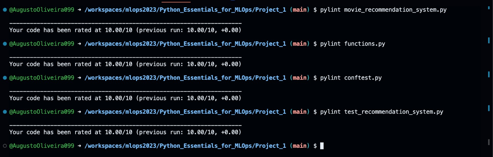
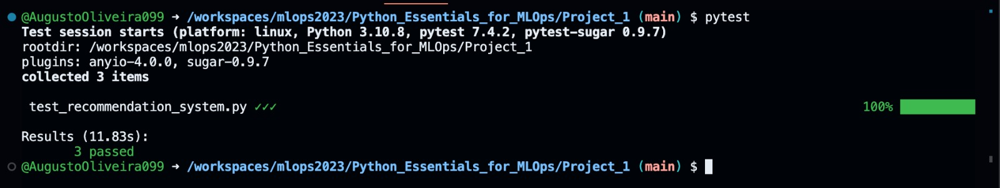

# Movie Recommendation System
## Introdução
O [script python](https://github.com/AugustoOliveira099/mlops2023/blob/main/Python_Essentials_for_MLOps/Project_1/movie_recommendation_system.py) presente neste repositório faz recomendações de 10 filmes a partir do título de um filme passado como parâmetro. São encontradas os 5 títulos mais relevantes por meio do parâmetro, levando-se em conta apenas os títulos em si. Em seguida, a partir do título mais relevante encontrado anteriormente, são analisados os usuários que fizeram uma boa avaliação para ele, ou seja, são pessoas com o gosto parecido com o do usuário do script. Essa análise diz respeito a quais os filmes que essas pessoas também fizeram uma boa avaliação. Em posse de todos títulos de filmes que as pessoas com um gosto parecido com o da pessoa que está executando o código, são analisadas as avaliações de todos os usuários para essa lista de filmes. Por fim, é feita uma comparação entre os scores (Número total de recomendações divido pela quantidade de usuários que fizeram as recomendações) dos usuário com um gosto similar o do interessado pela lista de filmes e dos usuários no geral. Os filmes escolhidos são aqueles que possuem a maior diferença entre os scores.

## Como executar
Para executar é extremamente simples. Basta estar no diretório ``Project_1`` e seguir os passos abaixo.

Instalar as dependências requeridas.
```
pip install -r requirements.txt
```

Executar o script com um dos comandos a seguir, substituindo ``movie_title`` pelo título desejado:
```
python movie_recommendation_system.py -t "movie_title"
```
```
python movie_recommendation_system.py --title "movie_title"
```

## Código
Seguindo os padrões de boas práticas, foi definido um [arquivo](https://github.com/AugustoOliveira099/mlops2023/blob/main/Python_Essentials_for_MLOps/Project_1/functions.py) contendo as funções que serão utilizadas e um outro que será o [script (main)](https://github.com/AugustoOliveira099/mlops2023/blob/main/Python_Essentials_for_MLOps/Project_1/movie_recommendation_system.py) a ser executado. A seguir serão mostradas algumas partes importantes da main.

Abaixo está a verificação se o script está sendo executado como uma dependência ou não, só sendo possível fazer com que ele funcione se for executado diretamente. Além disso, está a configuração do logging, usado para informar o andamento dos processos para o usuário, a definição de como o usuário deve informar o código por linha de comando, e o download dos dados que serão utilizados, caso não existam no diretório.
```
if __name__ == '__main__':
    # Configuração inicial do logging
    # Com level logging.INFO, também é englobado o level logging.ERROR
    logging.basicConfig(level=logging.INFO, format='%(levelname)s: %(message)s')

    # Iniciando o parse para receber o título do filme como parâmetro
    parser = argparse.ArgumentParser(description="Movie Recommendation System")
    parser.add_argument("-t", "--title", type=str, help="The title of the movie")
    args = parser.parse_args()

    # get the movie title
    movie_title = args.title

    # read the data
    try:
        if not os.path.exists(DIRECTORY_NAME):
            logging.info("Downloading the zip file")

            download_zip_file()
        else:
            logging.info("The data is already downloaded")
    except requests.exceptions.ConnectionError:
        logging.error("Connection Error")
    except requests.exceptions.Timeout:
        logging.error("Timeout Error")
    except requests.exceptions.HTTPError:
        logging.error("HTTP Error")
    except zipfile.BadZipFile:
        logging.error("The downloaded file is not a valid ZIP file.")
```

A seguir está sendo mostrado a importação dos dados para um dataframe. Ademais, a limpeza do título dos filmes, fazendo com que permaneça apenas letras, números e espaços, com a posterior criação de uma coluna para armazená-los. Por fim, a instanciação da classe TfidfVectorizer, transformando dos títulos dos filmes limpos em uma matriz TF-IDF, e em posse dessa matriz, são encontrados os 5 filmes mais similares com o título escolhido para ser pesquisado.
```
# Importando o arquivo
logging.info("Getting the data")
movies_df = pd.read_csv("ml-25m/movies.csv")

# Limpando o título do filme
logging.info("Cleaning the movie title")
movies_df["clean_title"] = movies_df["title"].apply(clean_movie_title)

# Instanciando o TF-IDF vectorizer
logging.info("Instantiating the TF-IDF vectorizer")
tfidf_vectorizer = TfidfVectorizer(ngram_range=(1,2))

# Ajustando e transformando os dados com base na instância TF-IDF
logging.info("Adjusting and transforming the data")
tfidf_vectorizer.fit_transform(movies_df["clean_title"])

# Obtém os 5 filmes mais similares a partir do título
results = search_similar_movies_by_title(movies_df, tfidf_vectorizer, movie_title)
```

Com isso, agora os dados das avaliações dos filmes são processados em um dataframe. Com o título que mais se aproximou daquele pesquisado, obtido na etapa anterior, são encontrados os 10 melhores filmes para o interessado assistir, lenvando-se em conta a classificação de usuário com um gosto parecido com o da pessoa que está utilizando o script e a classificação de pessoas no geral. Então, os filmes encontrados são exibidos.
```
logging.info("Reading the ratings dataframe")
# Lendo os dados de classificação dos filmes
ratings_df = pd.read_csv("ml-25m/ratings.csv")

# Encontrando os filmes similares
print("")
logging.info("Finding the similar movies")
movies_recommendations = find_similar_movies(results.iloc[0]["title"], movies_df, ratings_df)

# Exibe as recomendações
if movies_recommendations.empty:
    print(f"No recommendations could be found based on the movie {movie_title}.")
    print("Please, check if there are no spelling errors in the provided title.")
    print("If the error persists, change the movie title.")
else:
    print(f"\nOur 10 recommendations for you, based on the movie {movie_title}, are:\n")
    i = 0
    for index, row in movies_recommendations.iterrows():
        i += 1
        title = row["title"]
        genres = row["genres"]
        print(f"{i}. {title} {genres}")
```

## Boas práticas
Para manter uma legibilidade no código, ser de fácil interpretação e possuir uma manutenção rápida, boas práticas são cruciais. Nesse sentido, foi utilizado a biblioteca ``pylint``, que analisa e dá uma nota de 0 a 10 para o código, verificando se segue as diretrizes definidas no PEP 8 (Python Enhancement Proposal 8), que é o guia de estilo para código Python.

Use o comando abaixo para executar o pylint, substituindo ``file_name`` pelo nome do arquivo que será avaliado.
```
pylint file_name
```

Ao executar esse comando para os arquivos python presentes neste projeto, foi obtido os seguintes resultados:


## Testes
Caso queiramos incrementar a base de dados referente às avaliações e à lista de filmes para que ela permaneça atual, refatorar ou melhor uma função já existente, é muito importante a utilização de testes para mitigar os possíveis erros que podem acontecer nesse processo. 

Assim, para que isso seja possível, será utilizada a biblioteca ``pytest``. Para executar os [testes implementados](https://github.com/AugustoOliveira099/mlops2023/blob/main/Python_Essentials_for_MLOps/Project_1/test_recommendation_system.py), basta rodar um dos seguintes comandos no terminal:
* O pytest identifica automaticamente o arquivo pela conversão do nome começar com ``test_``
```
pytest
```
* Especificar qual é o arquivo contendo a implementação dos testes
```
pytest test_recommendation_system.py
```

Abaixo está a execução dos testes implementados:


## Copyright ©
O código aqui implementado foi adaptado de um projeto de portifólio do [Dataquest](https://www.dataquest.io/). Veja a [solução original](https://github.com/dataquestio/project-walkthroughs/blob/master/movie_recs/movie_recommendations.ipynb) e também uma [videoaula no YouTube](https://www.youtube.com/watch?v=eyEabQRBMQA&ab_channel=Dataquest) do passo a passo e da explicação de como foi feita a implementação original.
