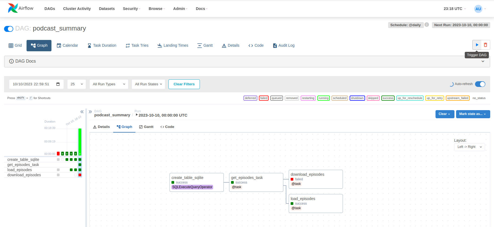
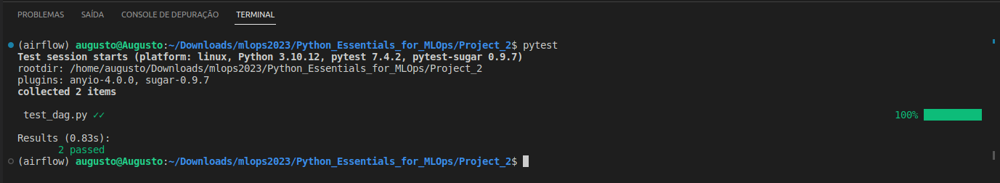
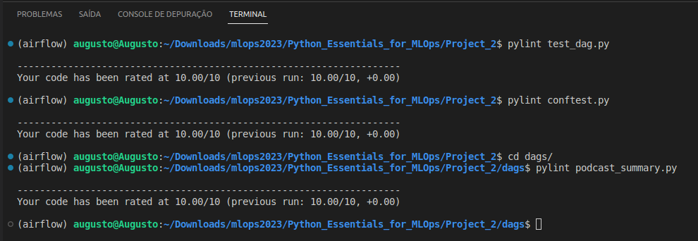

# Airflow Data Pipeline to Download Podcasts

## Introdução
O projeto é uma pipeline que será executada diariamente e contará com um banco de dados relacional (SQLite) para armazenas os metadados dos episódios que já foram baixados. Ele utiliza o airflow para construir uma pipeline que procura por novos episódios de podcast diariamente para fazer download. Todos os dias é otbido, a partir [deste endpoint](https://www.marketplace.org/feed/podcast/marketplace/), um arquivo .xml com 50 metadados dos episódios de podcast mais recentes, caso algum deles não esteja no banco de dados, ele é adicionado e depois feito o download do arquivo em áudio, no formato .mp3.

## Como executar
Ao executar este projeto no codespace, não será possível entrar na aplicação do airflow. Apesar de ser possível acessar a porta 8080 (porta padrão ao executar o ambiente vitual do airflow), não será possível fazer login e interagir com as DAGs.

Ao executar com sistemas operacionais do tipo unix (linux ou macOS, por exemplo), é possível acompanhar o andamento das pipelines, seja atual ou não, ao executar o ambiente do airflow.

Para windows, eu consegui fazer funcionar até certo ponto. Ao tentar iniciar o ambiente virtual, o airflow roda o comando ``$ pwd``, que é nativo dos sitemas operacionais do tipo unix, interropendo, assim, a inicialização do ambiente virtual.

Garanta que você tem o python 3.10.x instalado. Ele será necessário para instalar o [airflow 2.7.1](https://airflow.apache.org/docs/apache-airflow/stable/release_notes.html#airflow-2-7-1-2023-09-07), que é a versão mais recente até a data de implementação desta pipeline.

<strong>Para criar um ambiente virtual, siga os passos abaixo.</strong>
Obs.: Os comando a seguir devem ser executados a partir da pasta ``Project_2``.

Criar um ambiente virtual chamado airflow
```
python3.10 -m venv airflow
```

Ativar o ambiente:
```
source ./airflow/bin/activate
```

Para instalar o airflow:
```
AIRFLOW_VERSION=2.7.1
PYTHON_VERSION="$(python --version | cut -d " " -f 2 | cut -d "." -f 1-2)"
CONSTRAINT_URL="https://raw.githubusercontent.com/apache/airflow/constraints-${AIRFLOW_VERSION}/constraints-${PYTHON_VERSION}.txt"
pip install "apache-airflow==${AIRFLOW_VERSION}" --constraint "${CONSTRAINT_URL}"
```

Depois que estiver instalado, você pode executar a aplicação:
```
airflow standalone
```

Após isso, será criado automaticamente a pasta ``~/airflow`` e a aplicação ficará disponível na porta ``http://localhost:8080``. No terminal será disponibilizado seu <strong>login e senha</strong>, e é de extrema importância que você os encontre para que possa entrar na aplicação.

Agora será preciso fazer uma auteração nas configurações do airflow.

Entre na pasta ``dags/`` e obtenha e copie para área de transferência o caminho até este diretótio:
```
cd dags/
pwd
```

Depois de copiar o caminho da pasta, entre no arquivo de configurações do airflow. Para obter o caminho até o esse arquivo:
```
find ~/ -name "airflow.cfg"
```

Entre no arquivo com um editor de texto do próprio terminal:
```
nano {path_of_the_airflow.cfg_file}
```

Edite a variável ``dags_folder`` para que aponte para a sua pasta dags, cujo caminho você já possui na área de transferência. No meu caso ficou assim:
```
dags_folder = /home/augusto/Downloads/mlops2023/Python_Essentials_for_MLOps/Project_2/dags
```

Instale as dependência do projeto:
```
pip install -r requirements.txt
```

Como utilizaremos um banco de dados SQLite, temos que instalá-lo:
```
wget https://www.sqlite.org/snapshot/sqlite-snapshot-202309111527.tar.gz
tar -xzvf sqlite-snapshot-202309111527.tar.gz
cd sqlite-snapshot-202309111527
./configure
make
sudo make install
sqlite3 --version
```

Em um terminal, dentro da pasta ``dags/``, criaremos o banco de dados:
```
sqlite3 episodes.db
.databases
.quit
```

Agora precisamos fazer uma conexão do airflow com o banco de dados. Substitua o caminho a seguir pelo caminho até o seu banco de dados ``episodes.db``, criado anteriormente:
```
airflow connections add 'podcast_summary' --conn-type 'sqlite' --conn-host '/home/augusto/Downloads/mlops2023/Python_Essentials_for_MLOps/Project_2/dags/episodes.db'
```

Agora, cheque a conexão do airflow com o seu banco de dados:
```
airflow connections get podcast_summary
```

Mude a variável ``USER_PATH``, dentro do arquivo ``dags/podcast_summary.py`` para que contenha o caminho da sua máquina até o diretório que está contendo a pasta ``mlops2023/``. No meu caso:
```
USER_PATH = "/home/augusto/Downloads"
```

Agora, pare a execução do airflow e a execute novamente para aplicar as mudanças feitas:
```
airflow standalone
```

Na página inicial, em que há uma lista com as DAGs, procure pela opção "podcast_summary" e despause essa DAG clicando no toggle ao lado de seu título. Em seguida, clique no título e você obterá mais informações sobre ela, como grafos e logs sobre cada task da pipeline. Para executar a pipeline, basta clicar no ícone de "play" na parte superior direita.



A última task foi interrompida, uma vez que não quero os 50 episódios de podcast, mas alguns foram baixados para testar a eficiência da pipeline.

## Explicando o código
A pipeline é criado a partir do decorador @dag(), que está sendo configurada ter o nome de "podcast_summary", ser executada diariamente, ter uma data de incício no dia 08/10/2023 e não ser executado retroativamente, ou seja, ele indica que o DAG não deve executar tarefas retroativamente para as datas em que o DAG deveria ter sido executado, mas não foi devido a atrasos ou falta de execução.
```
@dag(
    dag_id='podcast_summary',
    schedule_interval="@daily",
    start_date=pendulum.datetime(2023, 10, 8),
    catchup=False
)
def podcast_summary():
    """
    Cria a pipeline de dados com o decorador @dag
    """

    # Cria o banco de dados
    logging.info("Creating the table, if it don't exists")
    database = create_database()

    # Faz o fetch dos metadados dos episódios
    logging.info("Downloading episodes metadata")
    podcast_episodes = get_episodes_task()

    # Especifica que primeiro deve ser criado o banco de dados e
    # depois feito o donwload dos episódios
    database.set_downstream(podcast_episodes)

    # Armazena os novos episódios baixados
    load_episodes(podcast_episodes)

    # Faz o download dos arquivos de audio
    download_episodes(podcast_episodes)

podcast_summary()
```
A pipeline é responsável por chamar as tasks. Primeiro é criado o banco de dados, depois é feito o download dos metadados nos episódios, em seguida esses metadados são armazenados no banco de dados e, por fim, faz o download dos episódios em .mp3.

Abaixo está o código responsável por criar o banco de dados relacional. Esse banco de dados possuirá apenas a tabela ``episodes``, com as colunas "link", como chave primária, "title", "filaname", "published" e "description".
```
def create_database() -> SQLExecuteQueryOperator:
    """
    Cria a tabela episodes no banco de dados.

    Returns:
        create_database (SQLExecuteQueryOperator): Um operador Airflow
            para criar a tabela no banco de dados.
    """
    return SQLExecuteQueryOperator(
        task_id='create_table_sqlite',
        sql=r"""
        CREATE TABLE IF NOT EXISTS episodes (
            link TEXT PRIMARY KEY,
            title TEXT,
            filename TEXT,
            published TEXT,
            description TEXT
        );
        """,
        conn_id="podcast_summary"
    )
```

A seguir está e a função responsável por fazer a requisição dos metadados dos 50 últimos episódios lançados e sua task. Essa função possui uma task responsável por chamá-la pois para executar o teste para a requisição dos metadados é preciso da função sem o decorador @task().
```
def get_episodes() -> list:
    """
    Faz a requisição dos metadados dos 50 últimos episódios.

    Return:
        episodes (list): Lista de dicionários contendo os 50 
            últimos episódios lançados.
    """
    try:
        # Requisição dos dados
        data = requests.get(PODCAST_URL, timeout=20)
        # Parse de xml para dicionário
        feed = xmltodict.parse(data.text)
        # Obtém a lista de episódios
        episodes = feed["rss"]["channel"]["item"]
        # Mostra a quantidade de episódios encontrados
        logging.info("Found %s episodes.", len(episodes))
        return episodes
    except requests.exceptions.ConnectionError:
        logging.error("Connection Error")
        raise
    except requests.exceptions.Timeout:
        logging.error("Timeout Error")
        raise
    except requests.exceptions.HTTPError:
        logging.error("HTTP Error")
        raise
    except Exception as e:
        logging.error("Error downloading podcast episodes metadata: %s", str(e))
        raise

@task()
def get_episodes_task() -> list:
    """
    Task para requisitar os podcasts do endpoint
    Return:
        list: Lista de dicionários contendo os 50 últimos episódios lançados.
    """
    return get_episodes()
```
Na função get_episodes é feita uma requisição HTTP do tipo GET e os metadados dos 50 últimos episódios, no formato xml, são capturados. Depois disso, são extraídos esses dados para uma lista.

Adiante está a task responsável por inserir os dados referentes aos episódios na tabela SQL.
```
@task()
def load_episodes(episodes: list) -> None:
    """
    Insere no banco de dados os novos episódios baixados e
    impedindo que eles se repitam

    Arg:
        episodes (list): Lista com os metadados dos episódios
    """
    try:
        hook = SqliteHook(sqlite_conn_id="podcast_summary")
        stored = hook.get_pandas_df("SELECT * from episodes;")
        new_episodes = []
        for episode in episodes:
            if episode["link"] not in stored["link"].values:
                logging.info("Storing episode %s on database", episode["link"])
                filename = f"{episode['link'].split('/')[-1]}.mp3"
                new_episodes.append([episode["link"],
                                    episode["title"],
                                    episode["pubDate"],
                                    episode["description"],
                                    filename])
        hook.insert_rows(table="episodes", rows=new_episodes, target_fields=["link",
                                                                            "title",
                                                                            "published",
                                                                            "description",
                                                                            "filename"])
    except Exception as e:
        logging.error("Error loading episodes into the database: %s", str(e))
        raise
```
No código acima, é possível notar que os episódios só serão inseridos se eles não estiverem na tabela.

Abaixo está a task que faz o download, de fato dos arquivos no formato .mp3.
```
@task()
def download_episodes(episodes: list) -> None:
    """
    Faz o download dos arquivos de áudio no formato .mp3 dos episódios 
    que ainda não foram baixados

    Arg:
        episodes (list): Lista com os metadados dos episódios
    """
    try:
        for episode in episodes:
            filename = f"{episode['link'].split('/')[-1]}.mp3"
            audio_path = os.path.join(EPISODE_FOLDER, filename)
            if not os.path.exists(audio_path):
                logging.info("Downloading %s", filename)
                audio = requests.get(episode["enclosure"]["@url"], timeout=300)
                with open(audio_path, "wb+") as f:
                    f.write(audio.content)
    except requests.exceptions.ConnectionError:
        logging.error("Connection Error")
        raise
    except requests.exceptions.HTTPError:
        logging.error("HTTP Error")
        raise
    except IOError as e:
        logging.error("Error writing podcast episode to disk: %s", str(e))
        raise
    except Exception as e:
        logging.error("Error downloading podcast episodes in .mp3: %s", str(e))
        raise
```
No código, o nome do arquivo é definido, assim como o seu caminho, que junta o caminho da pasta ``episodes`` com o nome do arquivo. No caso do caminho já existir no seu computador, significa que o áudio já foi baixado, caso contrário, é preciso baixá-lo. Ao fazer isso, o arquivo é salvo na pasta episodes.

## Testes
Para garantir que tudo está funcionando bem, é crucial a existência de testes. Sendo assim, foram criados dois testes para garantir que as funções da pipeline estão sendo executadas como devem.
* O primeiro testa se o banco de dados está sendo criado como deve, verificando a instância do dado retornado;
* O segundo teste verifica se a função ``get_episodes`` está realmente retornando uma lista, e se essa lista possui tamanho 50. A lista sempre deve possuir tamanho 50 por conter justamente o tamanho dos últimos 50 episódios lançados, o que sempre acontecerá, já que o [marketplace](https://www.marketplace.org/) é uma organização consolidada no mercado.

Os testes serão feitos executando o comando abaixo na pasta ``Projeto_2``:
```
pytest
```

Caso prefiro, é possível executar seguinte comando, na mesma pasta:
```	
pytest test_dag.py
```

Para realizar os testes, o arquivo ``test_dag.py``, contendo as funções assertivas, utiliza as fixtures presentes no arquivo ``conftest.py``.

A seguir estão os testes sendo executados e possuindo assertividade de 100%:


## Pylint
Para manter código limpo, organizado e de fácil manutenção, foi utilizado o ``pylint`` para seguir um padrão pré estabelecido.

O pylint dá uma nota de 0 a 10 para um código python, caso a nota seja menor que 10, ele indica o que precisa ser corrigido para que a nota aumente.

Para fazer uso do pylint, basta usar o comando abaixo, substituindo ``file_name`` pelo nome do seu arquivo python:
```
pylint {file_name}.py
```

No meu caso, foram utilizados alguns comandos. Para o arquivo ``conftest.py``, por exemplo:
```
pylint conftest.py
```

Para o arquivo ``test_dag.py``:
```
pylint test_dag.py
```

Para o arquivo ``podcast_summary.py``:
```
pylint podcast_summary.py
```

A seguir estão as saídas para os comandos citados:


## Copyrights ©
Esse código foi adaptado para fins educacionais a partir do [código fonte](https://github.com/dataquestio/project-walkthroughs/blob/master/podcast_summary/podcast_summary.py) acessível no GitHub. Também existe uma [vídeo aula](https://www.youtube.com/watch?v=s-r2gEr7YW4&ab_channel=Dataquest) no YouTube feita pelo autor do código explicando o passo a passo de como é feito. Esse é um projeto do [Dataquest](https://www.dataquest.io/).
