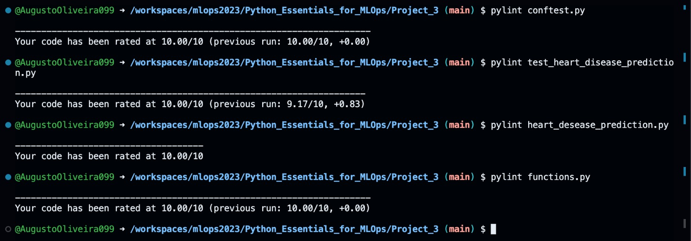
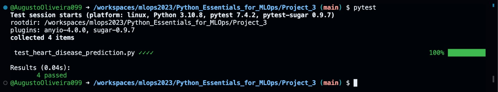

# Previsão de doenças no coração
## Introdução
Este é um projeto que visa prever se uma pessoa terá ou não doenças no coração com base em algumas características sobre ela. Para fazer essa previsão, será utilizado o algorítmo k-NN(k-Nearest Neighbors), que leva em conta os k (número inteiro) vizinhos mais próximos para prever se a pessoa tem ou não doença cardiaca.

## Como usar
Antes de poder usar o script python, instale as dependências necessárias:
```
pip install -r requirements.txt
```

Para que você consiga usar o código, abra seu terminal na pasta ``Projeto_3`` e execute um dos comandos a seguir, substituindo o número pela proporção desejada de dados que serão destinados para testar o modelo obtido a partir dos dados de treinamento (resto dos dados que não serão destinados para teste).
```
python heart_desease_prediction.py -ts 0.15
```
```
python heart_desease_prediction.py --test_size 0.15
```

## Explicando o código
Depois de importar as bibliotecas e funções que serão utilizadas no script, foi definido o parse dos argumentos e depois capturado o valor do argumento passado, verificando se ele é válido.
```
# Iniciando o parse
parser = argparse.ArgumentParser(description="Movie Recommendation System")

# Tamanho do do conjunto de teste como parâmetro de linha de comando
parser.add_argument("-ts", "--test_size", type=str, help="Proportion of test size to data size")

args = parser.parse_args()

# Obtém o test_size como float
test_size = float(args.test_size)

# Verifica se os argumentos são válidos
if test_size <= 0 or test_size >= 1:
    logging.error("The test size you chose is out of limits: 0 < test_size < 1")
    sys.exit(1)
```

Em seguida, os dados são lidos e são impressas algumas informações sobre eles:
```
# Lê os dados
try:
    heart_desease_df = pd.read_csv('./heart_disease_prediction.csv')
except FileNotFoundError:
    logging.error("The CSV file is not available.")
except pd.errors.EmptyDataError:
    logging.error("The CSV file is empty or corrupt.")
except ValueError as e:
    logging.error("ValueError while read data:\n")
    logging.error(e)

# Imprime as 5 primeiras linhas do dataframe
logging.info("Current dataframe: \n %s", heart_desease_df.head)
# Imprime uma descrição do dataframe
logging.info("Current dataframe describe: \n %s", heart_desease_df.describe)
```

Depois disso, são criados dois gráficos de barras para mostrar a distribuição dos dados categóricos, sendo um deles a distribuição com base na variável ``HeartDesease`` e o outro sem especificação de relação. A partir daí, os dados são limpos, sendo eliminadas as linhas que possuem ``RestingBP`` iguais a 0, e também as linhas que possuem ``Cholesterol`` iguais a 0, e é plotado um mapa de calor para a correlação entre cada coluna do dataframe estudado. E, segundo a correlação entre as colunas, são mostrados as que possuem maior correlação com a variável alvo.
```
# Cria os gráficos e os salva como imagens
try:
    logging.info("Starting EDA")
    if not os.path.exists("images/results"):
        os.makedirs("images/results")
    create_graphs(heart_desease_df)
except ValueError as e:
    logging.error("ValueError building graphs:\n")
    logging.error(e)
except IOError as e:
    logging.error("IOError while save the graphs:\n")
    logging.error(e)

# Limpa os dados
try:
    logging.info("Starting data cleaning")
    heart_desease_df = clean_data(heart_desease_df)
except ValueError as e:
    logging.error("ValueError while data clean.")
    logging.error(e)

# Converte recursos categóricos em variáveis fictícias
heart_desease_df = pd.get_dummies(heart_desease_df, drop_first=True)
logging.info("Data after converting the categorical features into dummy variables:\n")
logging.info(heart_desease_df.head)

# Define a matriz de correlação
logging.info("Getting the correlated matrix")
correlations = abs(heart_desease_df.corr())

# Plota o mapa de calor para a matriz de correlação de Pearson
# e o salva como imagem .png
logging.info("Plotting the heatmap for the data")
fig = plt.figure(figsize=(10, 14))
fig.suptitle("Pearson's correlation heat map", fontsize=16)
sns.heatmap(correlations, annot=True)
plt.savefig("./images/results/Pearsons_correlation_heat_map.png")

# Captura e imprime as colunas que tem melhor correlação com a coluna
# HeartDisease e a sua porcentagem
most_correlated_col = correlations["HeartDisease"].sort_values(ascending=False)[1:6]
logging.info(
    "As seen in the heatmap, the columns most correlated with the 'HeartDisease' column are")
logging.info(most_correlated_col)
```

São definidas as matrizes de treinamento e de teste, a partir do parâmetro passado na linha de comando.
```
# Define X e y para ajustar o modelo
X = heart_desease_df.drop("HeartDisease", axis=1)
y = heart_desease_df["HeartDisease"]

# Separa os dados de treinamento e de teste
X_train, X_test, y_train, y_test = train_test_split(X, y, test_size=test_size, random_state=3)
```

Ao se observar a correlação entre as colunas e por conhecimentos externos, são definidas as 5 melhores colunas para que seja possível fazer a previsão correta se o indivíduo têm doenças cardíacas. Depois disso, são treinados 5 modelos para cada uma das características observadas, individualmente, e a acurácia de cada um deles é exibida.
```
# Define as 5 melhores features para se observar
top_5_features = ["Sex_M", "Oldpeak", "ExerciseAngina_Y", "ST_Slope_Flat", "ST_Slope_Up"]

# Ajusta o modelo para cada uma das 5 melhores features separadamente
for feature in top_5_features:
    # Transforma a Série em uma matriz bidimensional
    X_train_feature = X_train[feature].values.reshape(-1, 1)
    X_test_feature = X_test[feature].values.reshape(-1, 1)

    # Instancia classe KNeighborsClassifier com 5 vizinhos e dando peso
    # para a distância entre os vizinhos
    knn = KNeighborsClassifier(n_neighbors = 5, weights = "distance")
    knn.fit(X_train_feature, y_train)

    # Obtém e imprime a acurácia do modelo
    accuracy = knn.score(X_test_feature, y_test)
    accuracy *= 100
    logging.info("The accuracy to %s feature was: %.2f%%", feature, accuracy)
```

Em seguida, os valores são dimensionados para o intervalo (0, 1). Depois é feito o ajuste de apenas um modelo para todas as colunas que foram escolhidas, e exibida a acurácia desse modelo.
```
# Dimensiona os valores para o intervalo (0, 1)
scaler = MinMaxScaler()
X_train_scaled = scaler.fit_transform(X_train[top_5_features])
X_test_scaled = scaler.transform(X_test[top_5_features])

# Instancia classe KNeighborsClassifier com 5 vizinhos e dando peso
# para a distância entre os vizinhos
knn = KNeighborsClassifier(n_neighbors = 5, weights = "distance")

# Ajusta o modelo para os dados de treinamento
knn.fit(X_train_scaled, y_train)

# Obtém e imprime a acurácia do modelo
accuracy = knn.score(X_test_scaled, y_test)
accuracy *= 100
logging.info("The model's accuracy to 5 neighbors and weights = 'distance' is: %.2f%%", accuracy)
```

Agora, com o uso da classe GridSearchCV, é possível estabeles uma lista de hiperparâmetros variados que será feita a combinação entre eles. Com isso, é instanciada um elemento da classe KNeighborsClassifier e utilizada em conjunto com a classe GridSearchCV e os hiperparâmetros definidos. Em seguida, o modelo é ajustado aos dados de treinamento e depois são impressas a melhor acurácia e os melhores parâmetros.
```
# Define os hiperparâmetros
hyperparameters = {"n_neighbors": [3, 5, 7, 9, 11, 13, 15, 20],
                   "metric": ["euclidean", "manhattan", "minkowski"],
                   "weights": ["uniform", "distance"],
                   "p": [1, 2, 3, 5]
                   }

# Instancia KNN e GridSearchCV com os hiperparâmetros definidos
knn = KNeighborsClassifier()
knn_grid = GridSearchCV(knn, hyperparameters, scoring="accuracy")

# Ajusta o modelo com GridSearchCV
knn_grid.fit(X_train_scaled, y_train)

# Obtém e imprime o melhor score e melhores parâmetros
best_score = knn_grid.best_score_
best_score *= 100
best_params = knn_grid.best_params_
logging.info("Best model's accuracy: %.2f%%", best_score)
logging.info("Best model's parameters: %s", best_params)
```

Por fim, o melhor modelo obtido é usado para medir a acurácia no conjunto de dados de teste:
```
# Descobre e imprime a acurácia do melhor modelo para o conjunto de teste
best_estimator_accuracy = knn_grid.best_estimator_.score(X_test_scaled, y_test)
best_estimator_accuracy *= 100
logging.info("Model's accuracy on the test set: %.2f%%", best_estimator_accuracy)
```

## Boas práticas
Boas práticas de programação são cruciais para que códigos legível e de fácil manuteção sejam escritos. Tendo-se isso em vista, foi utilizado o pylint para avaliar cada arquivo python e dar uma nota de 0 a 10 de acordo com a conformidade do código com Guia de Estilo Python (PEP 8).

Para fazer uso dele, basta executar o comando a seguir substituindo python_file_name.py pelo nome do arquivo que será avaliado:
```
pylint python_file_name.py
```

Para os códigos desenvolvidso neste projeto, temos as seguintes avaliações:


## Testes
Para que seja possível mitigar ao máximo a presença de erros, é fundamental que existam testes voltados para verificar elementos cruciais do código. 

Sempre que algo seja alterado, seja uma refatoração de cõdigo, uma melhoria ou um ajuste na base de dados, eles devem ser executados.

Para isso, neste projeto, basta estar no diretório ``Projeto_3`` e executar o comando abaixo:
```
pytest
```

Para este projeto, a saída do comando acima foi:


## Copyrights ©
Este projeto é uma adaptação das instruções dados pelo [Dataquest](https://www.dataquest.io/) no [guia de projeto ``Predicting Heart Disease``](https://app.dataquest.io/c/134/m/740/guided-project%3A-predicting-heart-disease/8/hyperparameter-tuning?path=23&slug=machine-learning-in-python-skill&version=1).
